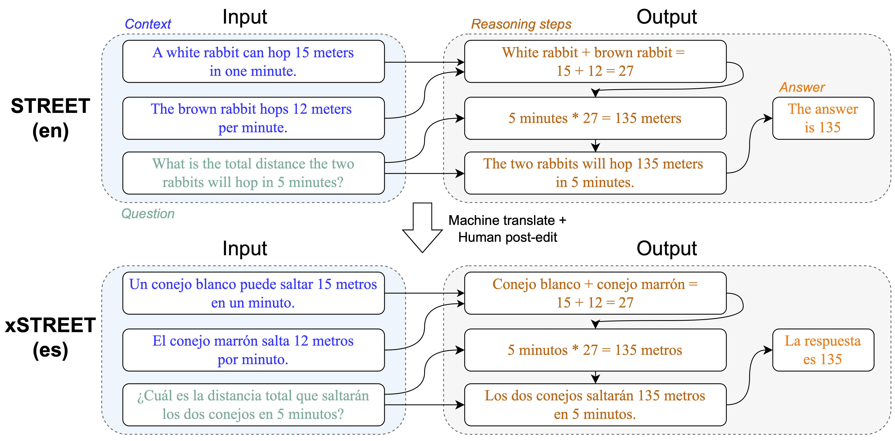

# xSTREET: Multilingual Structured Reasoning and Explanation Benchmark

### Datasets
* ARC 
* GSM8K
* AR-LSAT
* AQUA-RAT

In addition to English, the datasets are available in the following Languages:
* Spanish
* Arabic
* Russian
* Japanese
* Chinese 

## License

This project is licensed under the CC-BY-4.0 License.
